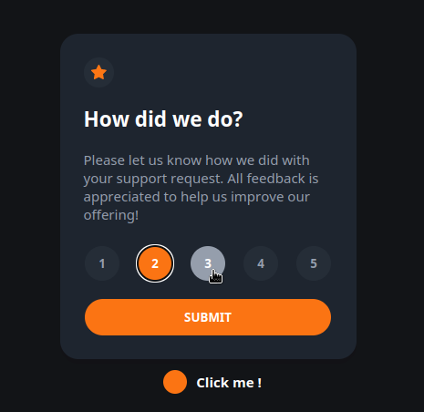
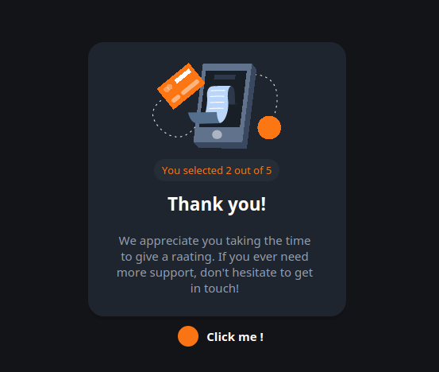
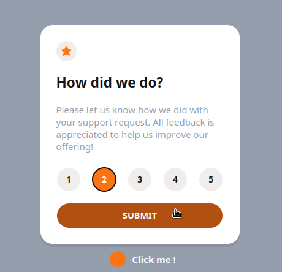
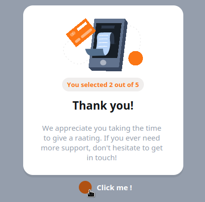

# FRONTEND MENTOR - Interactive Rating Component Solution

# Table of contents
- Overview
    - The challenge
    - Screenshots
    - Links
    - Personal addition - light mode
- My process
    - Built with
- Author

## Overview

### The challenge

- View the optimal layout for the app depending on their device's screen size
- See hover states for all interactive elements on the page
- Select and submit a number rating
- See the "Thank you" card state after submitting a rating

### Screenshots

### Links

- Solution URL: [Solution URL](https://github.com/graple-guillos/fem-interactive-rating-component)
- Live Site URL: [Live Site URL](https://fem-interactive-rating-component-ten.vercel.app/)

### Personal addition

I added a button that toggles between a bright colorscheme and the default colorscheme of the challenge. I thought that it 
would be interesting and a challange to me as a javascript beginner.

## My process

### Built with 

- Semantic HTML5 markup
- CSS custom properties
- Flexbox
- Sass(SCSS syntax) - functions, variables and mixins

## Author

- Frontend Mentor - [@graple-guillos](frontendmentor.io/profile/graple-guillos)
